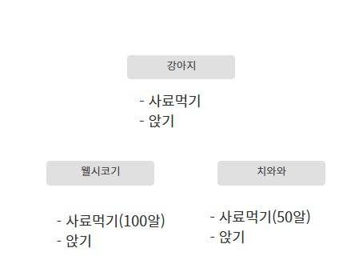

 

포스트를 읽고 나면 해당 그림이 이해가 될 것이다ㅎㅎ

 
## 도입 
OOP 란 무엇일까? 그리고 왜 필요한 것일까? 
이론적으로 control statement 와 data structure 만으로 어떠한 프로그램도 작성 가능하다. 문제는 입력받는 데이터가 복합적이고 프로그램의 로직이 복잡 해질 수록 프로그램의 작성과 유지보수가 힘들어 진다는 것이다. 
객체 지향 프로그래밍은 컴퓨터 프로그램을 명령어의 목록으로 보는 시각에서 벗어나 여러 개의 독립된 단위, 즉 ‘객체’들의 모임으로 파악하고자 하는 것이다. 현재 인기가 많은 언어 중에 python 과 java 등 다수의 언어로 OOP 가 가능하다. 이렇게 말하면 OOP 가 특정한 코드나 기술과 같이 보일 수도 있겠지만, 이는 프로그램을 설계하기 위한 방법론이자 현실 세계의 문제를 프로그램에 반영하기 위한 개념체계이다. 즉 기술이 아닌 사고방식이라고 할 수 있다. 
OOP 에서는 현실의 여러가지 대상 (Object)를 추상화 (Abstraction) 해서 표현한다. 
추상화 라는 개념이 한 번에 이해되지 않을 수 있다. 예시를 통해 알아보자. 

## 강아지 예시 

만약 철수가 키우는 강아지 몽이라는 특정한 실체, 즉 object 가 있다고 하자. 이 몽이라는 object는 강아지라는 class에 해당되기도 하고 강아지라는 클래스를 상속하는 웰시코기라는 클래스에 해당되기도 한다. 즉 Object는 Class를 통해 실현된 실체이다. 그리고 몽이는 영희가 키우는 치와와 돌돌이와 같은 강아지라는 Class이지만, 개별적인 특성(Attribute)을 갖는다. 강아지라는 Class 안에 사료먹기, 앉기와 같은 기능(method)을 하는 함수 또한 존재하고 몽이와 돌돌이 모두 강아지라는 Class에 해당되니, 사료먹기와 앉기가 가능하다. 추가로 더 생각해보자. 하지만 치와와와 웰시코기는 먹는 사료양이 다를 수 있다. 그렇다면 강아지클래스를 상속하는 웰시코기 클래스 안에서 사료먹기의 양을 조정할 수 있다. 이와 같이 method overriding이라고 한다. 

다양한 개념이 나왔는데 두서없이 적었던 내용을 간단하게 정리해보자.

## OOP의 3가지 특징 

### 캡슐화(Encapsulation)

데이터와 그 데이터를 다루기 위한 수단을 하나의 단위로 묶는 것, 앞서 설명한 Class를 통해 구현됨. (사료 먹기와 앉기의 기능을 가진 강아지 클래스) 
내부의 구체적인 구현은 최대한 숨기고, 필요한 부분만(interface)로 공개한다. 이를 통해 프로그램을 구성하는 요소들간의 결합성을 최소화시키고 유지보수 편의성, 재사용성을 높일 수 있다. 

    class Monster:
        level = 1
        habitat = "none"
        h_p = "100"

        def levelup(self):
            self.level += 1

        def damaged(self, input):
            self.h_p -= input

### 상속성(Inheritance)

특정 클래스(부모클래스)의 특징과 기능을 그대로 물려 받는 새로운 클래스(자식 클래스)를 만드는 것, 코드의 재사용성을 높임 (강아지 앉기, 사료 먹기 기능 물려 받음)

    class SheepMoster(Monster):
        sheep_name = ""

        def __init__(self, name):
            sheep_name = name
    
    sheep_ex1 = SheepMonster("mon1")
    sheep_ex1.levelup()

자식 클래스인 SheepMonster에 levelup 메서드를 선언하지 않았지만  부모클래스 Monster의 함수인 levelup을 상속받아서 사용할 수 있다. 
    

### 다형성(Polymorphism)

상속성으로 인해 발생한 상속 클래스 계층관계에서, 같은 이름을 가지는 메서드 들이 서로 다른 동작을 할 수 있음을 의미, 부모 클래스와 자식클래스에서 동일한 이름의 메서드가 존재하지만 그 메서드의 실제 동작은 서로 다를 수 있음(method overriding, 사료 먹기 구체적인 양이 다름)

    class SheepMoster(Monster):
        sheep_name = ""

        def __init__(self, name):
            sheep_name = name

        def levelup(self):
            self.level += 2
    
    sheep_ex1 = SheepMonster("mon1")
    sheep_ex1.levelup()

SheepMonster 개인 class attribute 도 추가로 선언 가능하다. 
또한 만약 주말 이벤트로 1+1 레벨업 이벤트를 진행한다면 levelup 메서드를 overridng 함으로 같은 이름의 메서드지만 다른 기능을 수행 할 수 있다. 
    

## 결론 

이와 같이 OOP의 개념은 좋은 프로그램을 설계하기위한 개념체계이다. 복잡한 프로그램을 작성할 경우에도 객체단위로 분할하여 구조화된 코드를 작성할 수 있으며 디버깅이 쉬운 코드의 재사용성이 높고 수정 및 유지보수가 매우 용이하다. 